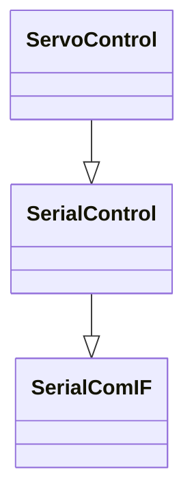

# Device Control Application Design



#### ServoControlクラス
- ServoMotorを制御するクラス
- Singletonであること
- 必要なメンバ変数
    - servoIndex
    - servoStatus
    - targetAngle
- 必要なメンバクラス
Servoとアプリとの通信方式に依存する？
通信方式にできれば、依存しない方がいい？→隠蔽する？
    - SerialControl
    - 

- 必要なメンバ関数
    - MoveAbs
    - MoveRel
    - Origin

#### SerialComIFクラス
- Seial通信の根幹クラス


---
### myCobotの制御を考える
- APIの調査
- IFの作りこみ
- Design patternの検討
- Singletonであること
- Observerの検討
- OOPの学習
- Mutexとは？→簡単なコードを書いて挙動を知る


---
#### Singletonパターン
Singleton基底テンプレートクラス
- SingletonBase.h
```cpp
#include <memory>

template <class T>
class Singleton
{
public:
    static T &singleton()
    {
        static typename T::singleton_ptr_t
            s_singleton(T::createInstance());
        return getReference(s_singleton);
    }

private:
    typedef std::unique_ptr<T> singleton_ptr_t;

    inline static T *createInstance() { return new T(); }
    inline static T &getReference(const singleton_ptr_t &ptr)
    {
        return *ptr;
    }

protected:
    Singleton() {}

private:
    Singleton(const Singleton &) = delete;
    Singleton &operator=(const Singleton &) = delete;
    Singleton(Singleton &&) = delete;
    Singleton &operator=(Singleton &&) = delete;
};
```
- staticキーワード
    - 静的変数であることを宣言。対義語：自動変数(動的変数)
    - 静的変数とは、プログラムが実行される前に、(プログラムがメモリ状にロードされたとき)既に位置が決まっている変数。アドレス固定
- 演算子オーバーロード
    - operator@(@は任意の演算子)というメンバ変数を定義すると、その演算子の振る舞いを変更することができる。これを演算子オーバーロードという。
    - 初期化ではコピーコンストラクタが、代入ではoperator=が呼ばれる

- コピーコンストラクタ
    - 

